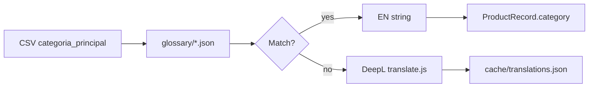

# Alterpop Importer — Project TODO

Lista alinhada com [`.cursor/rules/alterpop-importer.mdc`](../.cursor/rules/alterpop-importer.mdc) e o estado do repositório em `alterpop-importer/`.

Legenda: `[x]` feito · `[ ]` pendente · `[~]` parcial

---

## P6 — Curadoria activa e visibilidade (ACTIVE / DRAFT)

> Config: [`config/curation.json`](../config/curation.json). Gatekeeper: [`lib/importer/curation/`](../lib/importer/curation/). Relatório: `results/{jobId}/curated-drafts.json`.

| # | Tarefa | Estado |
|---|--------|--------|
| C1 | `allowedBrands` / `blockedCategories` / `priorityFranchises` | `[x]` |
| C2 | `resolveProductStatus()` integrado no `ProductImporter` | `[x]` |
| C3 | `status` em `productCreate` e `productUpdate` | `[x]` |
| C4 | Logs `[SYNC] ... Status / Curadoria` + DRY_RUN sem API | `[x]` |
| C5 | UI Jobs — contagem `curatedDrafts` | `[x]` |
| C6 | Teste `load-test-dry-run.js 50` | `[x]` |

---

## P0 — Stream importer (núcleo OcioStock)

> Implementação: [`lib/importer/core/streamImport.js`](../lib/importer/core/streamImport.js) + [`streamCsv.js`](../lib/importer/connectors/ociostock/streamCsv.js) (axios stream + csv-parser).

| # | Tarefa | Estado |
|---|--------|--------|
| S1 | Stream CSV sem carregar 29k SKUs na RAM | `[x]` |
| S2 | Fila p-limit `STREAM_CONCURRENCY=2` | `[x]` |
| S3 | `translateCategory()` por linha | `[x]` |
| S4 | `SYNC_LIMIT` env para testes dev | `[x]` |
| S5 | `failed.json` incremental (escrita atómica) | `[x]` `core/failedLog.js` |
| S6 | `runImport` usa stream por defeito | `[x]` |

---

## P0 — Rate limiter global (Shopify GraphQL)

> Regra do projeto: leaky bucket via `bottleneck` ou `p-limit`. **Implementação atual: `p-limit`** em [`lib/importer/shopifyRateLimiter.js`](../lib/importer/shopifyRateLimiter.js), integrado em [`lib/importer/shopifyClient.js`](../lib/importer/shopifyClient.js).

| # | Tarefa | Estado | Ficheiro(s) |
|---|--------|--------|-------------|
| P0.1 | Envolver todas as chamadas GraphQL no limiter | `[x]` | `shopifyClient.js` → `runThrottled()` |
| P0.2 | Configurar concorrência + intervalo mínimo via env | `[x]` | `config.js` — `SHOPIFY_GRAPHQL_CONCURRENCY`, `SHOPIFY_GRAPHQL_MIN_MS` |
| P0.3 | Retry 429 com backoff exponencial + `Retry-After` | `[x]` | `shopifyClient.js` |
| P0.4 | Documentar limites no README / mapping doc | `[x]` | `README.md`, `docs/OCIOSTOCK-CSV-MAPPING.md` |
| P0.5 | Avaliar migração `p-limit` → `bottleneck` (opcional, se a equipa preferir API de reservoir) | `[ ]` | `shopifyRateLimiter.js` |
| P0.6 | Métricas de throttling no job (`graphqlRetries`, `rateLimitWaits`) | `[ ]` | `ImportJob.js`, `shopifyClient.js` |
| P0.7 | Teste de carga controlado DRY_RUN (`load-test-dry-run.js`, SYNC_LIMIT=10) | `[x]` | `scripts/load-test-dry-run.js`, logs `[SYNC]` |
| P0.7b | Teste live 100 SKUs sem 429 com `CONCURRENCY=2` | `[ ]` | Dev Store |
| P0.8 | Aplicar delay também no `ProductImporter` (N mutations/SKU sem pausa entre produtos) | `[~]` | `ProductImporter.js` — chunk 50 + pause 2s; limiter no client cobre 429 |
| P0.9 | Avisar antes de import 29k SKUs sem batching/rate limit (workflow sénior) | `[x]` | Regra em `.cursor/rules/alterpop-importer.mdc` |

**Nota:** O rate limit está no **client**, não duplicado no `ProductImporter`. Novas chamadas GraphQL devem usar sempre `ShopifyClient.graphql()`.

---

## P1 — Validação de dados (pré-GraphQL)

> Validação central em [`lib/importer/validation/validateRecord.js`](../lib/importer/validation/validateRecord.js), chamada em [`runImport.js`](../lib/importer/jobs/runImport.js). O [`ProductImporter.js`](../lib/importer/importers/ProductImporter.js) **não valida** — assume records já filtrados.

### Já coberto em `validateRecord.js`

| Campo / regra | Comportamento | Onde falha no import |
|---------------|---------------|----------------------|
| `sku` vazio | Skip + `validationSkipped` | Antes de `ProductImporter` |
| `sku` > 255 chars | Skip | idem |
| `sku` com caracteres de controlo | Skip | idem |
| `title` vazio (só live) | Skip | idem |
| `availableQuantity` < 0 ou NaN | Skip | idem |
| `grossPrice` / `netPrice` vazios com `syncPrices` (live) | Skip | idem |

### Pontos em falta — acrescentar a `validateRecord.js` ou validação no `ProductImporter`

| # | Validação | Prioridade | Ficheiro sugerido |
|---|-----------|------------|-------------------|
| V1 | `imageUrl` — URL absoluta `http(s)://` quando presente no CSV | Alta | `[x]` `ProductImporter.sanitizeImageUrls()` → `failed.json` `invalid_image_url`; produto continua |
| V1b | Mesma regra em `validateRecord.js` quando `syncImages` (skip pré-import) | Alta | `[x]` `validateRecord.js` |
| V2 | `grossPrice` / `netPrice` negativos (não só “vazio”) | Alta | `validateRecord.js` |
| V3 | `barcode` vazio com aviso (warning, não skip) | Média | `validateRecord.js` |
| V4 | `description` HTML — escape já em `ProductImporter`; validar tamanho máximo Shopify | Média | `ProductImporter.js` |
| V5 | SKU existe na Shopify em modo `UPDATE_ONLY` — falha atual só no importer | Média | `ProductImporter.upsertOne()` |
| V6 | `inventoryItem` ausente após create — mensagem já no `InventoryImporter` | Média | `InventoryImporter.js` |
| V7 | Metafield `ociostock.net_price` — definir definition no Dev Dashboard antes de live | Alta | manual + `shopify.app.toml` |
| V8 | Relatório de validação na UI (contagem `validationSkipped`) | Baixa | `app.import.jsx`, `app.jobs.jsx` |

### Integração `ProductImporter` (recomendado)

| # | Tarefa | Estado |
|---|--------|--------|
| I1 | Importar `validateRecord` no início de `upsertOne()` como defesa em profundidade (live only) | `[ ]` |
| I2 | Não chamar `productCreateMedia` se `imageUrl` falhou validação | `[x]` URL inválida removida do record antes de `attachImages` |
| I4 | Resiliência: erro numa linha não para o batch | `[x]` `try/catch` por SKU em `ProductImporter.run()` |
| I3 | Dry-run: incluir `validationErrors` no payload de sucesso por SKU | `[ ]` |

---

## P2 — Limpeza OAuth legado e config

> Auth atual: [`app/shopify.server.js`](../app/shopify.server.js) + `shopify app dev`. OAuth manual `localhost:3456` está **obsoleto**.

| Ficheiro | Vestígio | Ação |
|----------|---------|------|
| [`.env`](../.env) | `SHOPIFY_REDIRECT_URI=http://localhost:3456/auth/callback` | `[ ]` Remover linhas OAuth legado (manter só keys + CSV + translation + rate limit) |
| [`.env.save`](../.env.save) | Idem + possíveis secrets | `[ ]` Apagar ficheiro ou alinhar com `.env.example`; já coberto por `.gitignore` `.env*` |
| [`.env.example`](../.env.example) | Limpo | `[x]` |
| [`shopify.app.toml`](../shopify.app.toml) | `redirect_urls = []` (CLI gere em dev) | `[x]` |
| [`.shopify/deploy-bundle/manifest 2.json`](../.shopify/deploy-bundle/manifest%202.json) | `localhost:3456`, URLs antigas | `[ ]` Regenerar com `shopify app deploy` ou apagar artefacto stale |
| [`SHOPIFY-CLI.md`](../SHOPIFY-CLI.md) | Menções a `localhost:3456` como anti-padrão | `[~]` OK como troubleshooting; opcional simplificar |
| [`README.md`](../README.md) | Referência OAuth embedded | `[x]` correto |

**Checklist segurança**

- `[x]` `.env*` no `.gitignore` (exceto `.env.example`)
- `[ ]` Confirmar que `.env` / `.env.save` nunca foram commitados (`git log -- .env`)
- `[ ]` Rotacionar `SHOPIFY_API_SECRET` se alguma vez partilhado em chat/logs

---

## P3 — Glossário de categorias ES → EN (estrutura centralizada)

> Implementação: [`lib/importer/transform/glossary/`](../lib/importer/transform/glossary/) — JSON editável sem redeploy.

### Estrutura atual

```
lib/importer/transform/glossary/
├── index.js              # translateCategory(), flushMissingGlossaryLog() (atomic)
├── categories.json       # mappings + settings (fallback: original)
└── segments.json         # segmentos após pipe (|)
```

### Formato `categories.json`

```json
{
  "mappings": { "Juegos / Juguetes": "Games & Toys" },
  "settings": { "fallback": "original", "caseSensitive": false }
}
```

Categoria sem match → ES original + entrada em `results/{jobId}/missing_glossary.json`.

### Fluxo de tradução (manter)



| # | Tarefa | Estado |
|---|--------|--------|
| G1 | Glossário em JSON (`mappings` + `settings`) | `[x]` |
| G2 | Script ou UI Settings para upload/edição do glossário (v2) | `[ ]` |
| G3 | Sincronizar entradas com [`docs/OCIOSTOCK-CSV-MAPPING.md`](./OCIOSTOCK-CSV-MAPPING.md) | `[x]` |
| G6 | Escrita atómica `missing_glossary.json` + lock por job | `[x]` `glossary/index.js` |
| G4 | Cobrir top N categorias do índice (`data/catalog-index/`) automaticamente | `[ ]` |
| G5 | Testes unitários: `PELÍCULAS` → `Movies`, pipe `ANIME / MANGA\|HELLO KITTY` | `[ ]` |

---

## P4 — DRY_RUN e operação segura

| # | Tarefa | Estado |
|---|--------|--------|
| D1 | Bloqueio live quando `DRY_RUN=true` no env | `[x]` `dryRunGuard.js` |
| D2 | UI: aviso visível se env `DRY_RUN=true` e utilizador clica Run import | `[ ]` `app.import.jsx` |
| D3 | `.env.example` com `DRY_RUN=true` por defeito | `[x]` |
| D4 | Primeiro import produção: `SYNC_LIMIT=10` + filtros + dry run | `[ ]` operacional |

---

## P5 — Documentação e DX

| # | Tarefa | Estado |
|---|--------|--------|
| DOC1 | Regra Cursor permanente | `[x]` `.cursor/rules/alterpop-importer.mdc` |
| DOC2 | Mapeamento CSV completo | `[x]` `docs/OCIOSTOCK-CSV-MAPPING.md` |
| DOC3 | Atualizar `SHOPIFY-CLI.md` — remover secção “legacy-cli” se pasta não existir | `[ ]` |
| DOC4 | Changelog interno por release de deploy | `[ ]` |

---

## Ordem de execução recomendada

1. **P2** — Limpar `.env` / `.env.save` e artefactos `.shopify/` stale  
2. **P1** — Validações V1–V2 (imagens + preços negativos)  
3. **P0.7** — Teste de carga rate limit  
4. **P3** — Glossário em JSON  
5. **P4** — Primeiro live controlado na dev store  

---

## Resumo executivo

| Área | Situação |
|------|----------|
| Rate limiter | **Implementado** (`p-limit`); bottleneck opcional; falta métricas e teste de carga |
| Validação | **Centralizada** em `validateRecord.js`; `ProductImporter` deve ganhar defesa em profundidade |
| OAuth legado | **TOML OK**; limpar `.env`, `.env.save`, manifest deploy stale |
| Glossário | **JSON + loader**; falta testes unitários (G5) e UI edição (G2) |
| Resiliência | **Por SKU** no importer; media/metafields com try/catch isolados |
